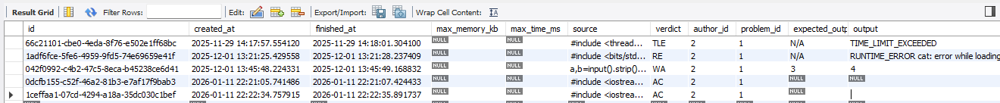

# Benchmarks (using [Hetzner CX33 VPS](https://sparecores.com/server/hcloud/cx33))



### C++ WA
```c++
#include <iostream>
using namespace std;
int main(){
    int a,b;
    cin>>a>>b;
    cout<<a+b+1;
    return 0;
}
```

### C++ AC
```c++
#include <iostream>
using namespace std;
int main(){
    int a,b;
    cin>>a>>b;
    cout<<a+b;
    return 0;
}
```
### C++ TLE
```c++
#include <thread>
#include <vector>
int main() {
    std::vector<std::thread> threads;
    while(true) threads.emplace_back([]{ while(true); });
    }
```

### PY AC
```py
a,b=input().strip().split()
print(int(a)+int(b)+1)
```


