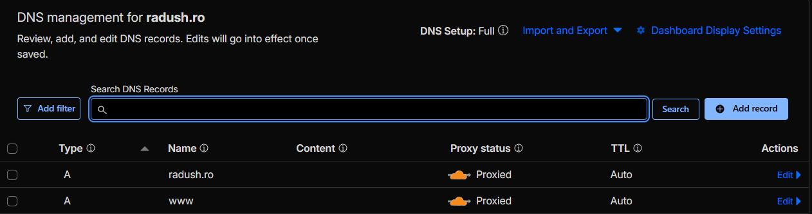

# CodeJudge - Online DSA Execution Platform

This project is a high-complexity system that moves beyond basic CRUD by implementing a decoupled, message-driven architecture to handle code compilation and execution in a secure, sandboxed environment (Docker containers).

## Engineering highlights emphazised on while working on the app

* **Sandboxed Execution:** Implements a secure "Docker-out-of-Docker" (DooD) architecture. Each submission runs in a hardened container with **Zero Network Access**, strict **CPU Quotas**, and **Memory Limits** to prevent resource exhaustion and Remote Code Execution (RCE).
* **Message-Driven Architecture:** Utilizes **RabbitMQ** to decouple the submission API from the heavy-lifting judge workers, ensuring the system remains responsive under high load.
* **Resource Management:** Dynamically manages container lifecycles via the Docker Java API, including automated cleanup and "Time Limit Exceeded" (TLE) handling through forced container termination.
* **State Management:** Features **MySQL** for relational data (problems, test cases) and **Redis** for efficient caching of the users' login attempts to prevent brute force login attacks.

### For benchmarks, check benchmarks.md

## Tech Stack

* **Backend:** Java 17, Spring Boot 3
* **Messaging:** RabbitMQ
* **Infrastructure:** Docker, Docker Compose
* **Database:** MySQL 8.4, Redis 7.4
* **Frontend:** Angular (Proof-of-Concept client, not stylized or with all functionalities)

## System Architecture

1. **Submission:** The user submits code via the Angular client/REST API.
2. **Queueing:** The submission is persisted in MySQL and a task is pushed to **RabbitMQ**.
3. **Execution:** A worker picks up the message, writes the source code to a shared volume (`/judge-workdir`), and spins up a language-specific Docker container (**C++** or **Python**).
4. **Security Layer:** The execution container is restricted:
* `withNetworkMode("none")`: Prevents data exfiltration.
* `withMemory`: Strictly limits RAM usage.
* `withCpuQuota`: Limits CPU cycles to prevent host starvation.


5. **Verdict:** The system compares `stdout` against expected results, identifies runtime errors or TLE, and updates the database.
6. **Polling:** The frontend polls the API to retrieve the final `Verdict` (AC, WA, TLE, CE, RE).

## Prerequisites
* Docker & Docker Compose
* A VPS and a domain


## Setup

### Step 0 - Configure the DNS record for the domain you intend to use


### Step 1 - Build the images where the actual code gets executed
```
cd src/main/resources/judge-image
docker build -t cpp-runner .
cd ../judge-image-py
docker build -t py-runner .
```

### Step 2 - Create the directories that can get accessed by both the runners and the app
```
sudo mkdir -p /judge-workdir
sudo chmod 777 /judge-workdit
```

### 3. Environment configuration

Create a `.env` file in the root directory and configure your credentials (see `.env.example` for a full list of required variables).

### 4. Deploy infrastructure

```bash
docker compose up --build -d
```

The application will be accessible at the domain specified in your `SECURITY_WEBSITE_DOMAIN`.

## Security Implementation Details

The core of CodeJudge is its security-first approach to code execution. The following snippet illustrates how the system enforces hardware-level constraints on untrusted code, as mentioned in the sandboxed execution bullet point:

```java
HostConfig hostConfig = HostConfig.newHostConfig()
    .withBinds(new Bind(path, new Volume("/work"))) // Shared Volume
    .withMemory(memoryLimitBytes)                  // RAM Cap
    .withMemorySwap(memoryLimitBytes)              // Disable Swap
    .withCpuQuota(50000L)                          // 50% CPU Cap
    .withNetworkMode("none");                      // Isolate Network

```